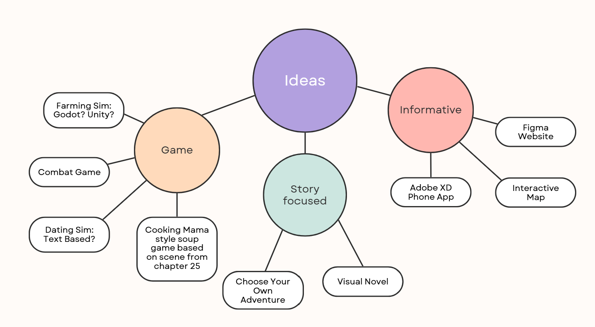
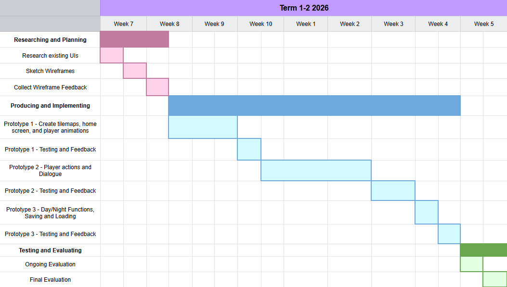
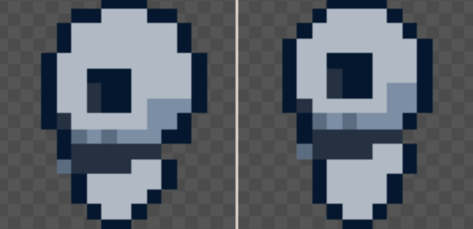

# 10CT_UX_Design_Project
## Project Proposal
#### Design Brief
My project will be a farming simulator where the player is required to farm necromatic ingredients while learning about the world of Harrow the Ninth through NPC interactions and cut scenes. My target audience is people aged 15+ who are interested in fantasy settings and farming games.
#### Book Choice and Justification
Harrow the Ninth by Tamsyn Muir follows the journey of necromancer Harrowhark Nonegasimus after her ascension to Lyctorhood in the preceeding book Gideon the Ninth, as she tries to become a soldier for the Necrolord Prime.But while Harrow navigates her new life in the Mithraeum with her apathetic and enigmatic teachers she slowly unravels the secrets a past version of herself has chosen to lock away deep in her subconscious. 
#### User Experience Type
My project will be a video game to allow the user to interact with the world of the Locked Tomb Series, and engage with the themes of depression, disillusionment, and how to move on after losing a loved one by putting them in Harrow's shoes.
#### Target Market
The intended audience of my game is teens and young adults who like high fantasy books, dark themes, and are of a higher reading level. My project will appeal to them because of its dark aesthetics and fun farming game mechanics which will make my project easy to pick up. Additionally the option to save game progress will allow teens to quickly close the game during class or getting on and off public transport without losing their progress.
#### Software and Tools
My project will use:
- Piskel for creating the pixel art for my sprites because of my familiarity with the program
- Godot for creating the rest of my game because of its easy dialogue options, accessability, and because I have more experience using it than unity, adobe XD, etc.
#### Initial Brainstorming

## Requirement Specification
### Functional Requirements
#### Purpose
The game will give fans a chance to engage with the themes, characters, and setting of the book by imagining the lives of characters outside of what is shown on-page
#### Use Cases
- Users will sow and farm crops unique to the world of the Locked Tomb like suspicious black root vegetables and purple bulbs
- Users will be able to interact with NPC characters like God, Gideon Nav's ghost, and Ianthe Tridentarius who will give additional context about the world and their relationships with Harrow. The user will be able to go up to NPCs and choose to start a conversation with them.
- Users will be able to save and then load their game
- Users will chop and collect wood.
#### Test Cases
- By selecting seeds in their inventory and clicking on tilled ground the user should be able to sow crops. This will be self-tested.
- When the user goes up to an NPC and choose to start a conversation with them they will select dialogue options to interact with them. This will be peer tested to make sure the dialogue is enjoyable to interact with.
- By pressing the "save" button on the main menu the user will be able to save their game. This will be self-tested.
- By selecting the axe in their inventory and then clicking on a nearby tree the user will be able to chop wood. I'll use a mixture of self-testing and peer evaluating to make sure the user experience is smooth.
### Non-Functional Requirements
#### Performance
The time between clicking the "start" button on the main menu and getting into the game should be under 2 seconds and the game should save the users progress every time they press the "save" button on the main menu
#### Usability
The transition between animations should be smooth, the player should stand out visually from the rest of the game so that the user can easily find themselves, the option buttons on the main menu should be large and readable, and the inventory should always be found at the bottom of the screen
#### Reliability
The window should always be the same size when played on any device and the saving and loading should be consist, allowing the user to play on both phones and computers
#### Security
The game shouldn't require the user to input any personal or sensitive information.

## Social, Ethical, and Legal Considerations
### Social Impact
- Target Audience: My target audience will be teens who will probably have good eyesight and are therefore able to read medium sized dialogue. Additionally, although the Locked Tomb Series has multiple translation, my target audience will only be english-speaking.
- Potential Benefits: My game would give new material to a dedicated fandom, fostering conversation and connection, and interesting a new audience in the series, potentially encouraging teens to engage with literature.
- Potential Risks: The project's necromatic themes could upset some users and also the representation of the God character from the Locked Tomb Series. To avoid these risks I'll make the home screen accurately present the darker nature of the game and use God's alternate title The Necrolord Prime
### Ethical Responsibilities
- User data and privacy: The game won't collect user data
- Representation and Inclusion: Despite the somewhat mundane setting of my project I'll try and accurately present the issues of immortality, sacrifice, and sapphic romance that are presented in Harrow the Ninth
- Content sensitivity: the project will obviously contain discussions of necromancy but will avoid having any on-screen gore
### Legal Considerations
- Copyright and Intellectual Property: The dialogue in the game will be heavily inspired by and in some cases quote the book in order to immerse the user in the experience of the book. However this will qualify as fair use, as I won't be using more than 10% of the book, won't profit off of the project, and will give credit to the original author.
- Terms of Use: [bleh]

## Gantt Chart

## PMI Table
### UI
| UI Name | Plus | Minus | Implication |
| ------- | ---- | ----- | ----------- |
| Stardew Valley | Stardew Valley’s UI allows the player to navigate through the game with an inventory at the bottom of the screen to help the player access tools for farming, a quick loading screen, effective NPC interactions, and a clock which gives the player a sense of time. | The pixel art for the game doesn’t have an aesthetically appealing colour palette. | Overall, Stardew Valley’s UI is very close to what I want to achieve with my prototype. I plan to create an inventory, clock, and player interactions similar to what appears in the game, however I’ll aim to create a more aesthetically appealing version and also narrow the scope of my project by cutting out features like the inventory/navigation menu, combat, and fishing. |
| Roots of Pacha | Features like dialogue options, beautiful pixel art, and intuitive menus make Roots of Pacha a successful game, as well as the unique features like prophecies which tie farming mechanics into the Stone Age setting. | The fishing mechanic is very annoying and the game is often critiqued for its slow pace. | Similarly to Stardew Valley, this game has a much broader scope than what I aim to achieve in my project and goes at a slower pace than I’d like my project to, but it also includes smooth character actions which make the game accessible. |
| Hollow Knight | Hollow Knight has a mysterious, dark, and aesthetically pleasing yet simple art style, intuitive mechanics, and concise, effective, NPC interactions as well as world-building which immerses you in the story. | The game is time consuming and can be inaccessible to casual players | In my game I'll aim to have similar visual elements to Hollow Knight, to create an atmosphere that aligns with the themes of my project, but my game will be much more intutive and give players a more calming, story focused game |

### Software Options
| Software Option | Plus | Minus | Implication |
| --------------- | ---- | ----- | ----------- |
| Unity | I've already used Unity for a platformer game and there are a wide variety of tutorials available online | I find the software annoying to use and don't have experience with the type of game I'm trying to make with Unity. | My lack of specific experience with this kind of project in Unity would make my project hard to complete within the timeframe of the task |
| Godot | I have the most experience with this software and have made a very similar farming sim game in the past which I could base my code off and just change the visuals of and add NPC interactions | It wouldn't be as challenging to use as a new platform | Godot is the most feasible option for this project, and if I used any other software I'd probably have to shrink the scope of the game |
| Unreal Engine | It could be a good experience to try out a new software | I have no experience whatsoever with this program, it primarily uses C++ which I'm not very comfortable with, and I have no idea whether I could realistically complete this project. | Due to time constraints and my limited experience with this software it doesn't seem like a good option for this project |

## Wireframes
[bleh]

### Organised Feedback
#### Usability
- save in main screen
#### Aesthetics
- character looks bad
#### Function
- bigger buttons and bigger cancel buttons

### Evaluation
bleh

# Prototype 1 - Pixel Art and Tile Maps
## Testing
For my design of the player I decided to represent Harrow with a skeleton because I thought that would be easier to draw in a 16 bit pixel art style than a human, however I had trouble with drawing the side profile. My first iteration was this

     

But after recieving user feedback that this looked "gross and squishy" I was inspired to create a wider design that better represented the spherical quality of my character's head in order to effectively improve the aesthetics of my design.